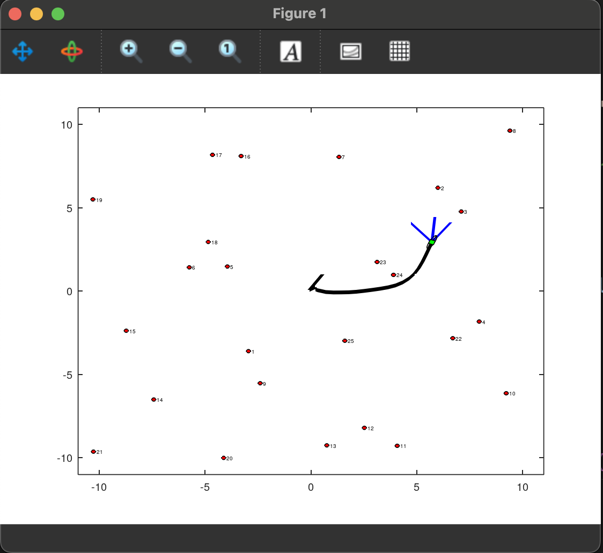
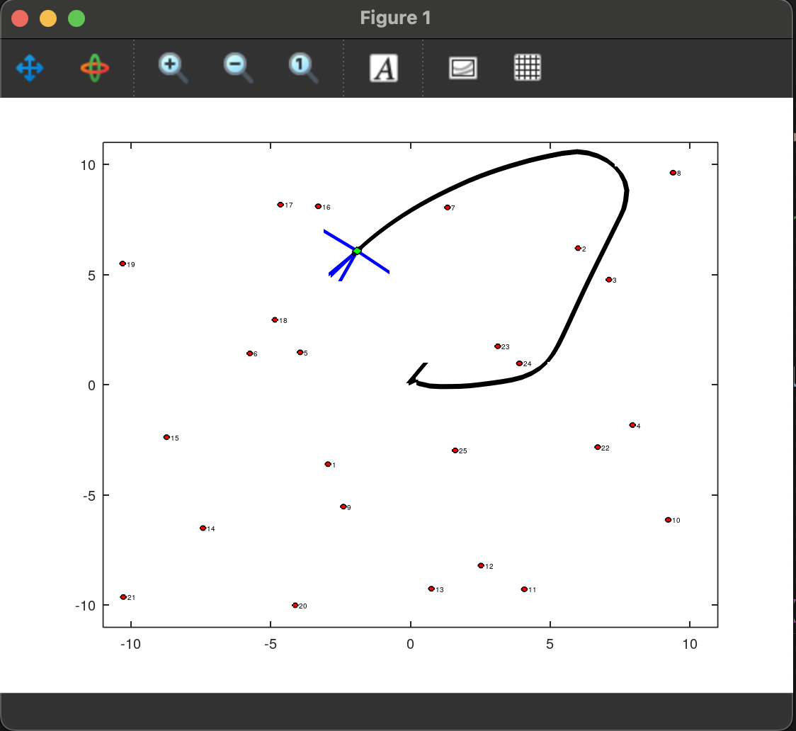

# Extended Kalman Filter for Pose Estimation (Bearing Only)

This project is a solution to an exercise from the Probabilistic Robotics course by [Prof. Giorgio Grisetti](https://sites.google.com/dis.uniroma1.it/grisetti/home?authuser=0), Sapienza University of Rome. The original repository with all the material can be found at this [link](https://gitlab.com/grisetti/probabilistic_robotics_2024_25). We want to estimate the pose of the robot trought a EKF. 

## Enviroment 

The environment is a 2D world consisting of a robot and a series of landmarks. Each landmark communicates an angle to the robot, which represents the measured angle from the landmark to the robot. This angle is expressed relative to the robot's reference frame.

<p align="center">
  
  
</p>

## Installation and running

1. Install octave:

```bash
sudo apt install octave
```

2. Clone the repo:

```bash
git clone https://github.com/FrancescoSpena/EKF-Pose-Estimation.git
```

3. Navigate into the folder EKF-Pose-Estimation and run the code:

```bash
cd EKF-Pose-Estimation && octave EKFLocalizationBearingOnly.m
```
## Results 

The filter accurately estimates the robot's pose without any drift. The Extended Kalman Filter (EKF) incorporates error feedback by calculating the difference between predictions and measurements, which is then propagated to minimize the error through a feedback loop. Furthermore, we can extend the filter's structure to address SLAM (Simultaneous Localization and Mapping) tasks. 
